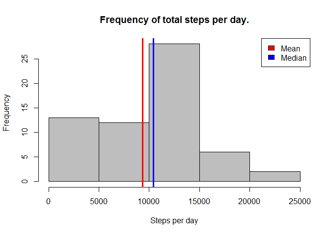

# Reproducible Research: Peer Assessment 1

For this analisys, the followed libraries are required


```r
library(dplyr)
```

## Loading and preprocessing the data

First, checks if the activity.csv file exists, if the file does not exists, then
unzip the activity.zip file, to finally load the activity.csv in the actDt variable.
Then convert the column date that is as factor to the date format, and show a summary 
about the data.


```r
if(!file.exists("activity.csv")) {
  unzip("activity.zip")
}
actDt <- read.csv("activity.csv")
actDt$date <- as.Date(actDt$date, "%Y-%m-%d")
summary(actDt)
```

```
##      steps             date               interval     
##  Min.   :  0.00   Min.   :2012-10-01   Min.   :   0.0  
##  1st Qu.:  0.00   1st Qu.:2012-10-16   1st Qu.: 588.8  
##  Median :  0.00   Median :2012-10-31   Median :1177.5  
##  Mean   : 37.38   Mean   :2012-10-31   Mean   :1177.5  
##  3rd Qu.: 12.00   3rd Qu.:2012-11-15   3rd Qu.:1766.2  
##  Max.   :806.00   Max.   :2012-11-30   Max.   :2355.0  
##  NA's   :2304
```


## The mean of the total number of steps taken per day

For each day we group all measurements and sum all steps ignorign NA's values, after grouper 
the values we make a histogram of the frequencies of days per steps. The mean of steps per day
if in red and the median of steps per day is in blue.


```r
stepsPerDay <- actDt %>% 
  group_by(date) %>% 
  summarise_each(funs(sum(steps, na.rm = T))) %>% 
  select(date, steps)
hist(stepsPerDay$steps, 
     xlab = "Steps per day",
     ylab = "Frequency",
     main = "Frequency of total steps per day.", 
     col = "gray")
abline(v = mean(stepsPerDay$steps, na.rm = T), col = "red", lwd = 3)
abline(v = median(stepsPerDay$steps, na.rm = T), col = "blue", lwd = 3)
legend('topright', legend = c("Mean", "Median"), fill = c("red","blue"))
```

<!-- -->

## What is the average daily activity pattern?


## Imputing missing values


## Are there differences in activity patterns between weekdays and weekends?
