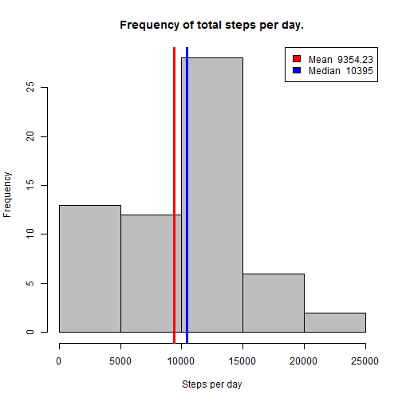
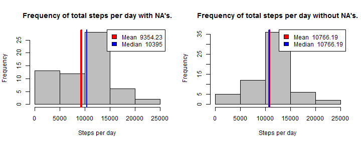

For this analisys, the followed libraries are required


```r
library(lubridate)
library(lattice)
library(dplyr)
```

## Loading and preprocessing the data

First, checks if the activity.csv file exists, if the file does not exists, then
unzip the activity.zip file, to finally load the activity.csv in the actDt variable.
Then convert the column date that is as factor to the date format, and show a summary 
about the data.


```r
if(!file.exists("activity.csv")) {
  unzip("activity.zip")
}
actDt <- read.csv("activity.csv")
actDt$date <- as.Date(actDt$date, "%Y-%m-%d")
summary(actDt)
```

```
##      steps             date               interval     
##  Min.   :  0.00   Min.   :2012-10-01   Min.   :   0.0  
##  1st Qu.:  0.00   1st Qu.:2012-10-16   1st Qu.: 588.8  
##  Median :  0.00   Median :2012-10-31   Median :1177.5  
##  Mean   : 37.38   Mean   :2012-10-31   Mean   :1177.5  
##  3rd Qu.: 12.00   3rd Qu.:2012-11-15   3rd Qu.:1766.2  
##  Max.   :806.00   Max.   :2012-11-30   Max.   :2355.0  
##  NA's   :2304
```


## The mean of the total number of steps taken per day

For each day we group all measurements and sum all steps ignorign NA's values, after grouper the values we make a histogram of the frequencies of days per steps. The mean of steps per day it in red and the median of steps per day it in blue.


```r
stepsPerDay <- actDt %>% 
  group_by(date) %>% 
  summarise_each(funs(sum(steps, na.rm = T))) %>% 
  select(date, steps)

stepsMean <- round(mean(stepsPerDay$steps, na.rm = T), 2)
stepsMedian <- median(stepsPerDay$steps, na.rm = T)
hist(stepsPerDay$steps, 
     xlab = "Steps per day",
     ylab = "Frequency",
     main = "Frequency of total steps per day.", 
     col = "gray")
abline(v = stepsMean, col = "red", lwd = 3)
abline(v = stepsMedian, col = "blue", lwd = 3)
legend('topright', 
       legend = c(paste("Mean ", stepsMean), paste("Median ",stepsMedian)), 
       fill = c("red","blue"))
```



## What is the average daily activity pattern?

This graph was made ignoring the missed values, the time series indicate the average of steps for each 5 minutes interval, the red point in the graph indicate the max steps count of a single interval in the all day.


```r
stepsPerInterval <- actDt %>%
    group_by(interval) %>%
    summarise_each(funs(mean(steps, na.rm = T))) %>%
    as.data.frame()

maxStepPerInterval <- stepsPerInterval[which.max(stepsPerInterval$steps),]

plot(stepsPerInterval$interval, 
     stepsPerInterval$steps, 
     type = "l", 
     xlab = "5 minutes interval", 
     ylab = "Average steps", 
     main = "Steps average per 5 minutes interval")
points(maxStepPerInterval, col = "red", pch = 16)
legend("topright", 
       legend = paste("Max steps is ", round(maxStepPerInterval$steps, 2)), 
       pch = 16, 
       pt.bg = "red", 
       bty = "n", 
       col = "red")
```


## Imputing missing values

This dataset has some missing values for the total of the 17568 records. How we can see, only the steps has missing values, the following code demonstrate the percentage of NA's for each variable.


```r
nasSummarie <- data.frame(
    Missing.Amount = c(
        sum(is.na(actDt$steps)),
        sum(is.na(actDt$date)),
        sum(is.na(actDt$interval))
    ),
    Missing.Percentage = c(
        mean(is.na(actDt$steps)) * 100,
        mean(is.na(actDt$date)) * 100,
        mean(is.na(actDt$interval)) * 100
    )
)
nasSummarie
```

```
##   Missing.Amount Missing.Percentage
## 1           2304           13.11475
## 2              0            0.00000
## 3              0            0.00000
```


For this quantity of missing values, we will put the mean by period to fill the NA's. The follow code describes this process. After that a new summary of the filled dataset is showed.


```r
actDtTidy <- actDt
meanInterval <- actDtTidy %>% 
    group_by(interval) %>% 
    summarise_each(funs(mean(steps, na.rm = T))) %>% 
    as.data.frame()

for(i in 1:nrow(actDtTidy)) {
    if(is.na(actDtTidy$steps[i]))
        actDtTidy$steps[i] <- (
            meanInterval %>% 
            filter(interval == actDtTidy$interval[i]) %>% 
            select(steps))[[1]]
}
summary(actDtTidy)
```

```
##      steps             date               interval     
##  Min.   :  0.00   Min.   :2012-10-01   Min.   :   0.0  
##  1st Qu.:  0.00   1st Qu.:2012-10-16   1st Qu.: 588.8  
##  Median :  0.00   Median :2012-10-31   Median :1177.5  
##  Mean   : 37.38   Mean   :2012-10-31   Mean   :1177.5  
##  3rd Qu.: 27.00   3rd Qu.:2012-11-15   3rd Qu.:1766.2  
##  Max.   :806.00   Max.   :2012-11-30   Max.   :2355.0
```

Added new values to missing values, we constructed two histogram, like before, to compare the dataset with missing value against the dataset without missing values.


```r
par(mfrow = c(1,2))

plotHist <- function (dataset, title) {
    stepsPerDay <- dataset %>% 
      group_by(date) %>% 
      summarise_each(funs(sum(steps, na.rm = T))) %>% 
      select(date, steps)
    
    stepsMean <- round(mean(stepsPerDay$steps, na.rm = T), 2)
    stepsMedian <- round(median(stepsPerDay$steps, na.rm = T), 2)
    hist(stepsPerDay$steps, 
         xlab = "Steps per day",
         ylab = "Frequency",
         main = title, 
         col = "gray")
    abline(v = stepsMean, col = "red", lwd = 4)
    abline(v = stepsMedian, col = "blue", lwd = 2)
    legend('topright', 
           legend = c(paste("Mean ", stepsMean), paste("Median ",stepsMedian)), 
           fill = c("red","blue"))
}

plotHist(actDt, "Frequency of total steps per day with NA's.")
plotHist(actDtTidy, "Frequency of total steps per day without NA's.")
```



The differecen between of two plots can be perceipt in the mean as now we have the filled values then mean of the measurements is equals and the first column where the NA's values changed to other bars.

## Are there differences in activity patterns between weekdays and weekends?

To compare the diferrence in measurements of the weekdays against the weekends we do two plots comparing the values. For this we did a new column to the dataset called weekday that store the factor *weekday* or *weekend*.


```r
actDtTidy$weekday <- "weekday"
actDtTidy[wday(actDtTidy$date) %in% c(1,7),]$weekday <- "weekend"
actDtTidy$weekday <- as.factor(actDtTidy$weekday)

dt <- actDtTidy %>% 
    group_by(weekday, interval) %>% 
    summarise_each(funs(mean(steps))) %>% 
    as.data.frame()

xyplot(steps ~ interval | weekday, 
   data = dt, 
   type = "l", 
   layout = c(1,2),
   xlab = "Interval",
   ylab = "Number of steps",
   main = "Difference in activity patterns between weekdays and weekends")
```


